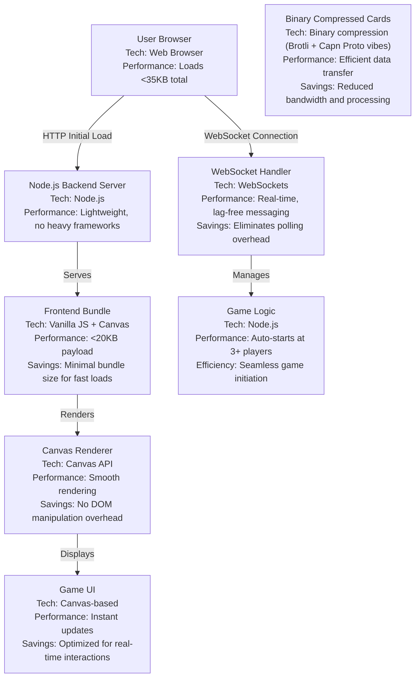

# Overkill Cards Against Humanity 

Welcome to the most overengineered version of Cards Against Humanity game ever! This is a hyper-optimized online multiplayer version that loads in under 35KB and delivers lols at lightning speed. 

Built for the most inappropriate party game, now with zero excuses for lag. Aiming to ridiculously overengineer this even more than it is.

## How to Play

Open `http://localhost:8080` in your browser. Grab friends, join a room, and let the chaos begin!

## Features

- **Blazing Fast:** Under 35KB payload. Loads faster than you can say "that's inappropriate."
- **Real-Time Multiplayer:** WebSockets for instant, lag-free card-slinging.

## Warning

This is Cards Against Humanity. Play at your own risk – and with consenting adults only.

## Tech Stack

- **Frontend:** Vanilla JS + Canvas
- **Backend:** Node.js + WebSockets
- **Data:** Binary-compressed cards (Brotli + Cap'n Proto vibes)

## Technical Architecture

Well here's the tech specs I guess.

Built for speed, laughs, and that sweet, sweet efficiency high. Contribute if you're as obsessed with optimization as I apparently am :)

**Cards Against Humanity** is a trademark of Cards Against Humanity LLC. This project is not affiliated with or endorsed by Cards Against Humanity LLC. Built for fun while absolutely pasted.
